# Kafka: The Power Rangers Factory (or How to Tame Data Chaos)

**Author:** Ivan Perea, Antonio Defez
**Date:** 2026-02-17
**Tags:** data-engineering, apache-kafka, backend, distributed-systems, tech-explained

---

## Introduction

If you work in tech, you've almost certainly heard of Apache Kafka. But if you try to explain it using terms like "distributed logs" or "broker clusters," people will look at you like you're speaking Klingon.

Today we're going to explain what Kafka is using a **Power Rangers factory** and a team of very efficient monkeys. But instead of just listing concepts, we're going to start with a real problem and let the solution reveal itself — because that's exactly how Kafka came to exist.

Our goal is simple: produce perfectly assembled Power Rangers.

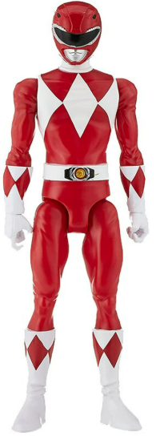

## The Factory

Welcome to the factory. Our job is to assemble Power Rangers action figures. In the world of data, a "Message" or "Event" is like one of these pieces. To have a **complete business object** (a finished Ranger), we need all its parts in the right state:

1. **Legs** (the base)
2. **Torso** (the body)
3. **Head** (the top)

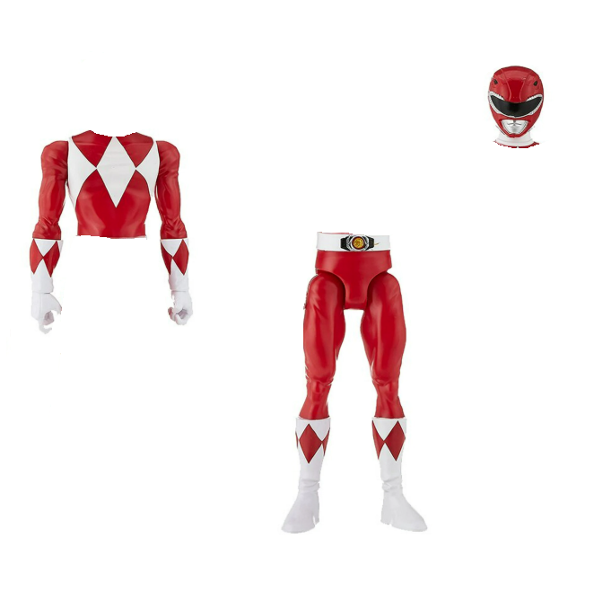

A Ranger is only "valid" if it's fully assembled. If a piece is missing (like a Ranger without a head), we have **incomplete data** — we can't ship it, and it just takes up space in our memory (or workbench).

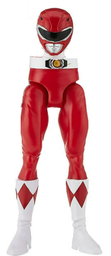

### The Rule of Order

In our factory, there's a strict physical constraint: **you cannot build from the top down.** You can't put a torso in the air if there are no legs to hold it. 

- **Legs** must arrive FIRST.
- **Torso** must arrive SECOND.
- **Head** must arrive THIRD.

If parts arrive out of order (e.g., Head -> Legs -> Torso), the monkey doesn't know what to do with them. A torso arriving before the legs? **Discarded.** A head before the torso? **Trash.** 

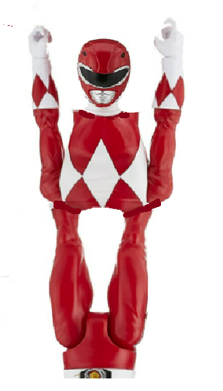

> Our goal is to ensure that for every "Ranger ID", the parts arrive at the worker in the exact order they were created.

Right now we produce two models: the **Red Ranger** and the **Blue Ranger**.

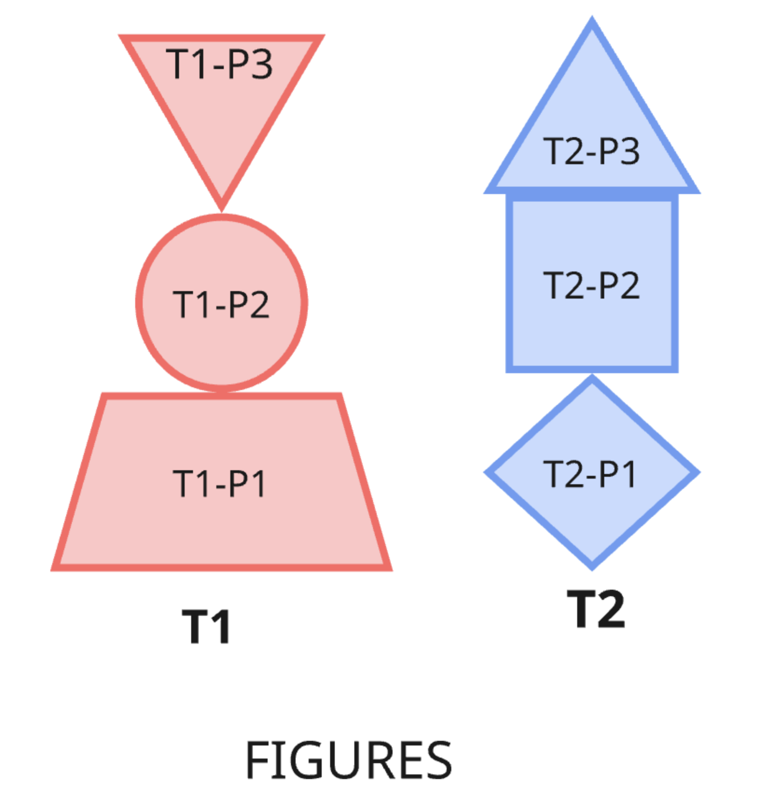

## Order Is Sacred (The Log)

Before we start the engines, there is one rule that never changes: the belt is a **sequential log**. Once a part is placed on the belt, it stays there. Its position is fixed. It doesn't jump over other parts, and it doesn't vanish.

In Kafka, this is the **ordering guarantee**. When a message lands in a Topic, its position is immutable. This is what allows us to reconstruct the state of a Ranger even if we have to stop and restart: we just follow the belt from where we left off.

But where do the parts come from? Outside the factory, **supplier trucks** arrive constantly, each one dumping parts onto the conveyor belt — a batch of Red legs here, a load of Blue torsos there. The trucks don't coordinate with each other; they just drop their cargo and leave. That's why parts for both models end up on a single belt — mixed together, in no particular order. Red legs, blue torsos, red heads, blue legs — all jumbled up.

> In Kafka terms, each truck is a **Producer** — any system that publishes messages into a Topic. Producers don't care who consumes the data or how; they just write to the belt and move on.

At the end of the belt sits a single monkey with a workbench. The workbench has two slots — one for each Ranger type. The monkey picks parts off the belt one by one and places each part in the correct slot, if it's the expected next piece.

> In Kafka terms, this belt is a **Topic** — a channel where all incoming data (messages) lands.

## The Happy Path

At low volume, this works beautifully. The monkey grabs each part, checks which Ranger it belongs to, and drops it into the right slot.

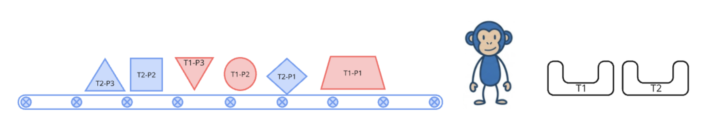

Red legs, then red torso arrives a few parts later, then red head. Meanwhile, blue parts fill in their slot in between.

The Red Ranger is fully assembled. The Blue Ranger follows shortly after. Belt empty. No parts discarded. No drama.

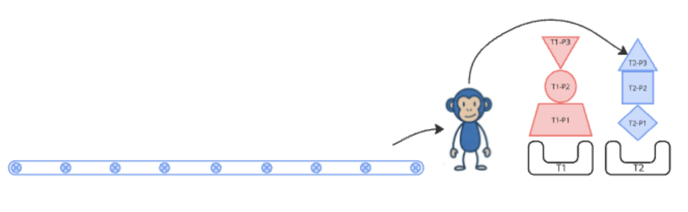

**One monkey. Low volume. Everything in order.** This is the ideal world.

Now let's break it.

## The Problem: We Need More Throughput

The factory grows. Orders pour in. The belt moves faster. One monkey can no longer keep up. The obvious idea: **add a second monkey**.

Two monkeys. Same belt. Each with their own workbench. On paper, capacity is doubled.

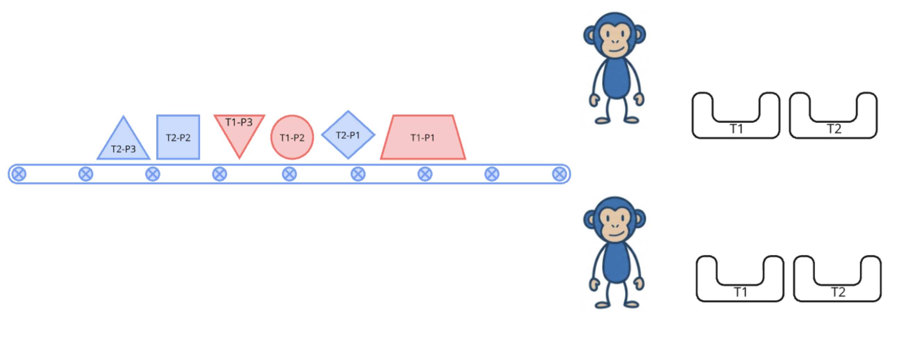

But watch what happens.

Monkey 1 grabs the **Red Legs** first — good, they go into Monkey 1's Red slot. But the **Red Torso** arrives next, and Monkey 2 grabs it. Monkey 2's Red slot is empty — it never saw the Red Legs. The Red Torso has nowhere valid to go.

**Discarded. Permanently.**

It gets worse. The **Red Head** arrives. Monkey 1 has the Red Legs, so it expects the Red Torso — which was already trashed by Monkey 2. The Red Head can't be placed either. Also discarded. The same race is happening simultaneously with Blue parts — Monkey 2 grabs Blue Legs, Monkey 1 grabs Blue Torso, neither has what they need.

**Final result:** belt empty, both Rangers incomplete, two trash piles, zero finished figures.

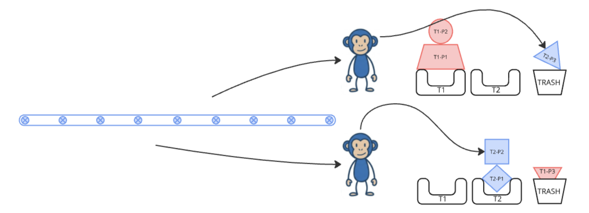

> Adding a second worker to a shared belt doesn't double capacity — it **destroys the ordering guarantee**.

The problem isn't the number of monkeys. **The problem is that both monkeys share the same belt.**

## The Solution: The Sorting Monkey

What if each monkey had its own belt, and a dedicated router decided which parts go to which belt — based on the Ranger color?

In the middle of the factory we introduce a new monkey with superhero reflexes: the **Sorting Monkey**. He sits between the main incoming belt and two shorter, dedicated belts:

- Sees something **Red** → Pushes it to **Belt 1**
- Sees something **Blue** → Pushes it to **Belt 2**

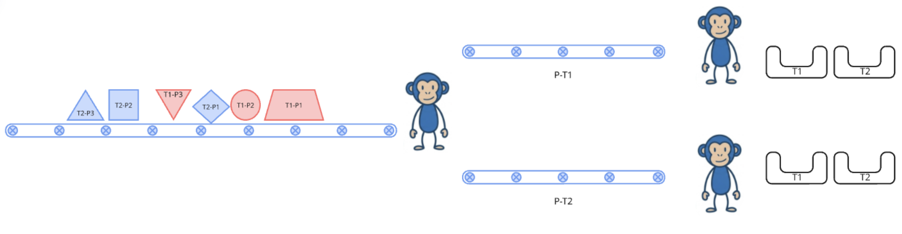

Each assembly monkey now watches exactly one belt. They never compete.

Monkey 1 only ever sees Red parts, in order. Monkey 2 only ever sees Blue parts, in order. Belt empty. Both Rangers assembled. **No trash. No conflicts.**

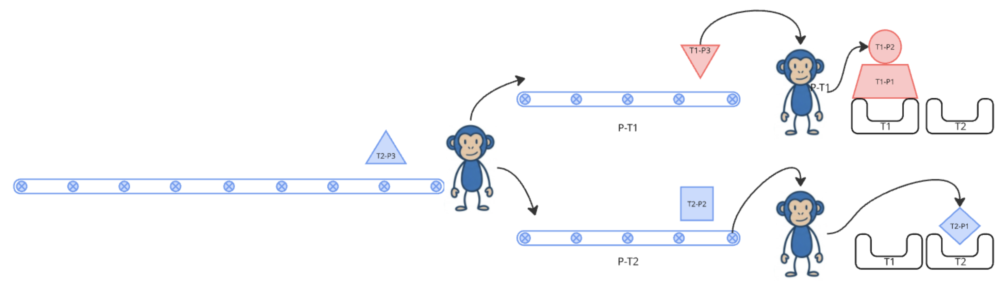

In the real world, the Sorting Monkey represents the **partitioning mechanism**, and the color is the **Partition Key**. Thanks to him, data gets organized into **Partitions** (the colored belts).

> **Note:** In our analogy, the Sorting Monkey lives inside the factory for simplicity. In real Kafka, the partitioning decision is actually made by the **Producer** (the truck) — it hashes the key and tells the Broker which partition to store the message in. The **Broker** handles storage and delivery, not routing. We've simplified this because it keeps the analogy cleaner, but keep it in mind when you dig into the real docs.

## A New Challenge: The Green Ranger

The factory adds a third model: the **Green Ranger**. Now the belt carries Red, Blue, and Green parts, all interleaved.

But we still have two belts and two monkeys. The 1:1 mapping between Ranger colors and belts has broken. **Where do Green parts go?**

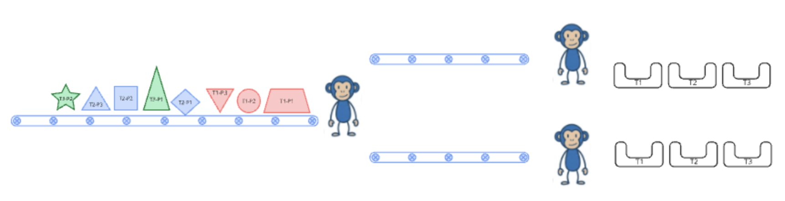

We have two options.

### Option A: Share a Belt

Keep two belts, but route two Ranger types to the same belt. For example: Red and Green parts both go to Belt 1. Blue parts go to Belt 2.

Monkey 1 now assembles both Red and Green Rangers — handling whichever part arrives next on its belt. Its workbench has three slots, and two of them are actively in use. Monkey 2 focuses solely on Blue.

**Result:** all three Rangers complete. No trash. But there's a trade-off — Monkey 1 is carrying twice the load of Monkey 2. The ordering guarantee still holds: all Red parts arrive at Monkey 1 in order, and all Green parts arrive at Monkey 1 in order. But Red and Green parts can be interleaved with each other on the same belt.

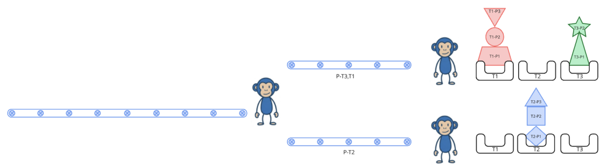

### Option B: Add Another Belt

Add a third belt. One belt per Ranger type. One monkey per belt. Clean 1:1:1 mapping.

Red → Belt 1. Blue → Belt 2. Green → Belt 3. Each monkey works at its own pace. No sharing, no interference, perfectly even load.

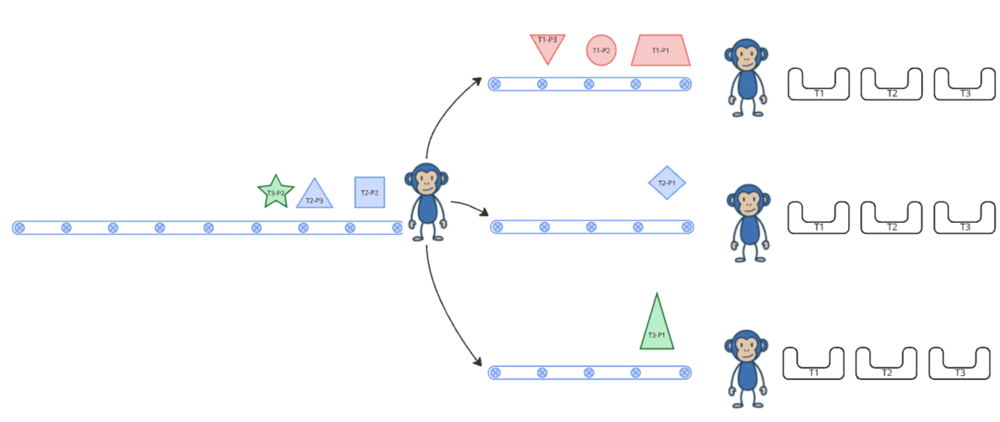

This is the cleaner solution — when you can afford the extra partition.

### Watch Out: Don't Repartition Lightly

Here's the catch. The partition key is assigned via a **hash over the partition count**. If you change the number of partitions, the hash changes — and parts start landing on different belts than before. Red parts that used to go to Belt 1 might suddenly route to Belt 2. Assembly breaks exactly like it did without a Sorting Monkey.

> **Plan your partition count upfront.** Changing it in production requires significant effort to preserve ordering.

## The Partition Ceiling

Partitions set the **ceiling on useful parallelism**. You can add as many monkeys as you want, but a belt can only be assigned to one monkey at a time.

| Belts (Partitions) | Monkeys (Consumers) | Outcome |
|:---:|:---:|---|
| 3 | 1 | One monkey handles all three belts — works, just slow |
| 3 | 3 | Perfect — one belt per monkey |
| 3 | 5 | 3 monkeys active, **2 sit idle doing nothing** |

> You can always add more partitions. You cannot add more consumers than partitions and gain anything.

## The Sticky Note (Offsets)

Each assembly monkey has a **sticky note**. If he goes on a lunch break, he jots down which part he was on. When he comes back, he knows exactly where to pick up without repeating any work.

> That sticky note is the **Offset** — a pointer that tracks each consumer's position in the partition.

## When a Monkey Goes Down

Three monkeys, three belts, everything running smoothly. Then Monkey 1 collapses mid-shift.

His belt keeps receiving Red parts from the Sorting Monkey — **but nobody picks them up**. The parts accumulate. Monkey 2 and Monkey 3 continue working on their own belts, unaware of what happened.

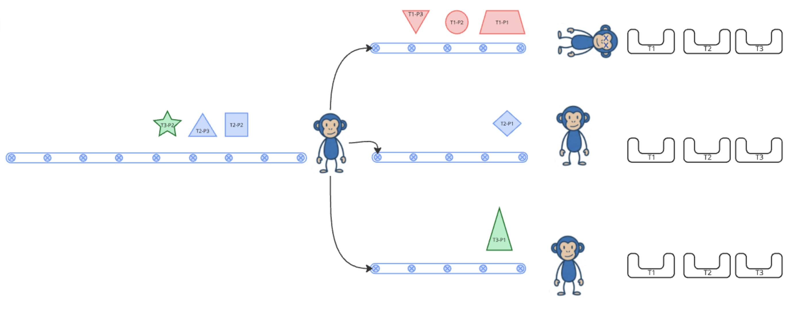

This growing pile of unprocessed parts is **Consumer Lag** — production outpacing consumption.

But the factory has a built-in safety net: the **Consumer Group**. The group detects that Monkey 1 has missed its heartbeat. A **rebalance** is triggered. Monkey 1's belt is reassigned to one of the surviving monkeys.

That monkey now handles two belts: its original one and Monkey 1's orphaned belt. It picks up right where Monkey 1 left off (thanks to the sticky note / offset) and processes the accumulated backlog.

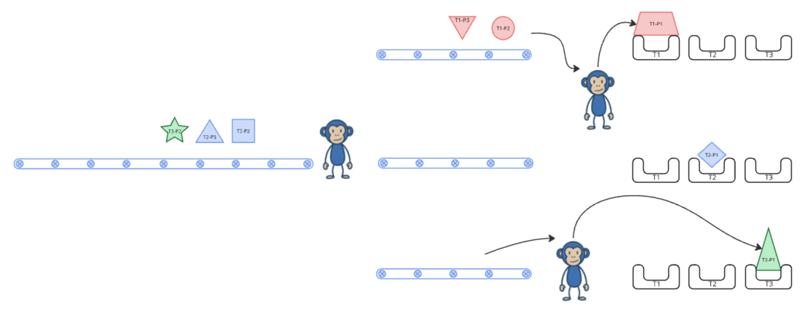

> No parts are lost — they waited on the belt. The only cost is **latency** while the backlog drains.

A monkey now handles two belts — throughput on those belts is halved until the group recovers or a replacement monkey spins up.

## Why This Factory Actually Works

### The trucks never stop — and that's fine (Scalability)

Ten trucks? A hundred? A thousand? The Sorting Monkey doesn't break a sweat. More cargo just means more belts and more assembly monkeys. The factory scales by cloning the setup, not by making one monkey work harder.

### Parts don't disappear (Persistence)

If a belt jams or a monkey passes out, the parts don't fall into a void — they sit on the belt, exactly where they were, waiting patiently. When things come back online, assembly picks up right where it stopped. Nothing is lost, nothing is duplicated.

### Monkeys cover for each other (Consumer Groups)

A monkey collapses? The rest of the team notices, shuffles belts around, and someone picks up the slack. No manager needed. No alarm bells. The factory just... keeps going.

## When Do You Need This Factory? (and When You Don't)

### Build the factory when...

- Trucks are arriving **non-stop and at high volume** — one lonely workbench won't cut it
- **Order matters** — legs before torso before head, always
- You need to **throw more monkeys at the problem** without redesigning the belts
- Trucks and monkeys **don't need to talk to each other** — drop it on the belt and walk away
- You might want to **rewind the belt** later to replay or audit what happened

### Maybe just use a table and a cron job when...

- You need a truck to **wait at the door until the Ranger is finished** (synchronous request/response)
- All parts of a Ranger must arrive **as a single package or not at all** (cross-message transactions)
- You get **three trucks a day** — a conveyor belt is overkill for that
- You need to **grab a specific part by its serial number** — belts don't do random access, databases do
- Order doesn't matter and you're fine with parts going wherever — just use a simple queue

## The Concept Map

| Factory Analogy | Kafka Concept |
|---|---|
| Main conveyor belt | **Topic** |
| Dedicated colored belt (Belt 1, Belt 2...) | **Partition** |
| Ranger color on a part | **Partition Key** |
| A single part (red leg, blue torso...) | **Message / Event** |
| Supplier truck | **Producer** |
| Sorting Monkey | **Partitioning mechanism** (see note) |
| Assembly Monkey | **Consumer** |
| Team of monkeys | **Consumer Group** |
| Workbench slot | **Consumer's in-progress state** |
| Assembly ordering rule | **Per-partition ordering guarantee** |
| Monkey's sticky note | **Offset** |
| Two Ranger types sharing one belt | **Multiple keys mapped to same partition** |
| Monkey dying + belt reassignment | **Consumer failure + group rebalance** |
| Backlog of parts on an idle belt | **Consumer Lag** |

## Conclusion

Kafka isn't magic. It's a very well-organized factory. Trucks dump parts, a Sorting Monkey routes them to the right belts, and assembly monkeys build Rangers without ever stepping on each other's toes. When one monkey falls, the team covers. When volume spikes, you add belts and monkeys. Parts never vanish, order is never broken, and the factory just keeps humming.

The whole trick boils down to one rule: **don't let monkeys share a belt**. Split the parts by color, guarantee order within each belt, and let each monkey work independently. That's it. That's Kafka.

Next time someone asks you what Kafka is, just tell them: "It's a monkey-powered Power Rangers factory." They'll either get it immediately or back away slowly — either way, you win.

## References

- [Apache Kafka Official Documentation](https://kafka.apache.org/documentation/)
- [Kafka: The Definitive Guide (Confluent)](https://www.confluent.io/resources/kafka-the-definitive-guide-v2/)
- [Confluent - What is Apache Kafka?](https://www.confluent.io/what-is-apache-kafka/)
